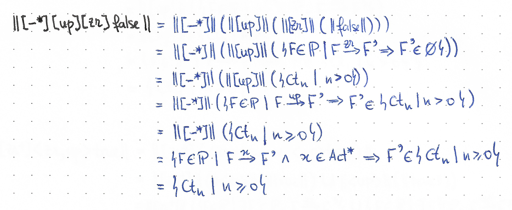
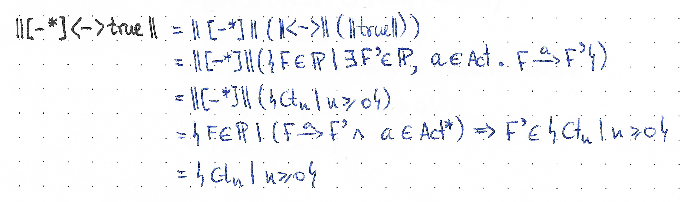
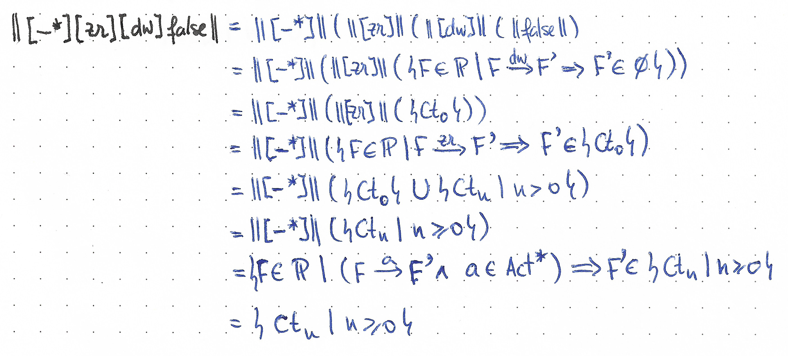
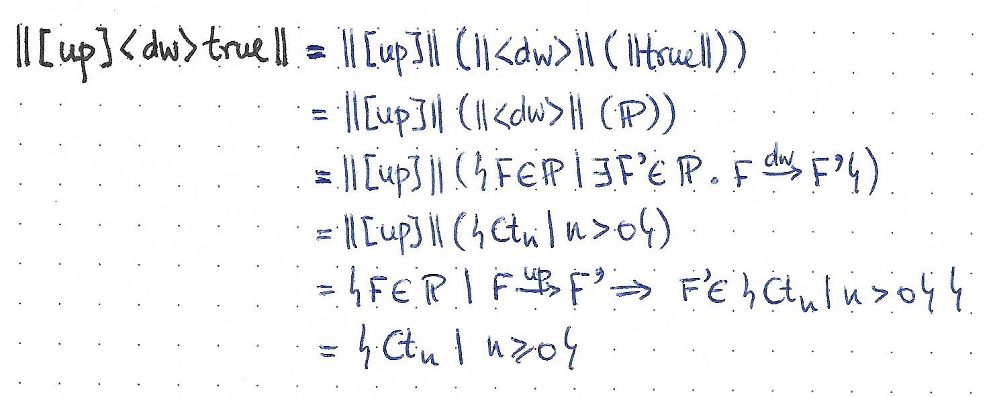
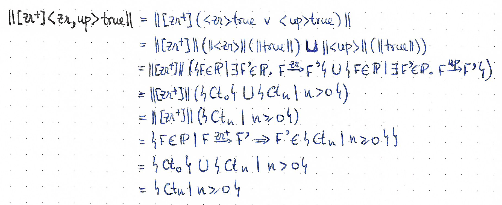
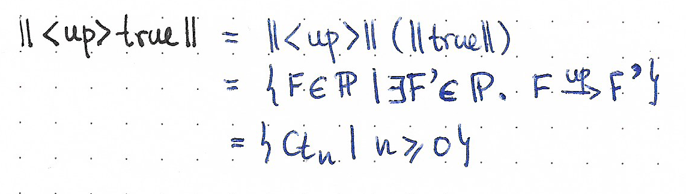
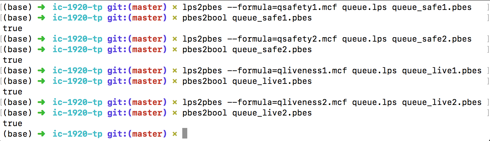

# TP 1: Interacção e Concorrência

 * 47419 João Bastos
 * 76361 André Sá

## Questão 1

Apresentamos de seguida o código em mCRL2 que define o modelo de um contador com o processo $Ct$ referido no enunciado.
De forma a ser viável a apresentação com as ferramentas utilizadas limitamos o LTS a dez estados na sua criação com o comando `lps2lts -l 10 Ctm.lps Ctm.lts`{.sh} .

```mcrl2
act up, zr, dw;
proc Ct(n: Int) = (n > 0)
               -> (dw . Ct(pred(n)) + up . Ct(succ(n)))
               <> (up . Ct(1) + zr . Ct(0)) ;
init Ct(0);
```

Utilizámos as ferramentas `lpsxsim`, `ltsgraph` e `ltsview` para observar o comportamento deste processo.

### `ltsgraph`

Usamos esta ferramenta de forma a verificar o grafo de transição do processo.


### `lpsxsim`

Usamos esta ferramenta para verificar de forma local, em cada estado, que ações são possíveis de realizar.


### `ltsview`

Esta ferramenta permite-nos verificar as ações possíveis de realizar em cada estado, como com `lpsxsim`, acrescentando uma parte gráfica em 3D ajudando na percepção da mesma.


\pagebreak

## Questão 2

Dois processos $Ct_n$ e $C^n$, são observacionalmente congruentes, $Ct_n = C^n$ sse:

 i. $Ct_n \approx C^n$
 ii. $Ct_n \underrightarrow{\tau} Ct_n$

Os processos $C^n$ e $Ct_n$ ($n \in \mathbb{N}$) são deterministas pois $\forall p \in S, a \in N: \exists! q \in S: (p, a, q) \in \rightarrow$[^lts_determinism], e como tal, $Tr_w(C^n) = Tr_w(Ct_n) \Leftrightarrow C^n \approx Ct_n$ sendo $Tr_w$ o conjunto dos traços fracos de um processo[^weak_trace]. Portanto a nossa prova é a de igualdade dos traços de $C^n$ e de $Ct_n$.

Caso $n = 0$:
 :  $$Tr(C^0) = Tr(Ct_0)$$
    $$\Leftrightarrow \{\ def\ Tr\ \}$$
    $$\{\epsilon\} \cup zr \cdot Tr(C^0) \cup up \cdot Tr(C^{1}) = \{\epsilon\} \cup zr \cdot Tr(Ct_0) \cup up \cdot Tr(Ct_{1})$$

Caso $n > 0$:
 :  $$Tr(C^n) = Tr(Ct_n)$$
    $$\Leftrightarrow \{\ def\ Tr\ \}$$
    $$\{\epsilon\} \cup dw \cdot Tr(C^{n-1}) \cup up \cdot Tr(C^{n+1}) = \{\epsilon\} \cup dw \cdot Tr(Ct_{n-1}) \cup up \cdot Tr(Ct_{n+1})$$

Tanto no caso $n = 0$, como no caso $n > 0$, existe uma dependência do caso seguinte, $n + 1$; no entanto, este caso $n + 1$ pode ser provado de forma similar, e portanto a prova é válida.


## Questão 3

A ferramenta mCRL2 não permite implementar a versão genérica, descrita no enunciado, dos processos $C$, $P$, e $Z$, portanto não será possível verificar a igualdade dos dois modelos com a ferramenta, de forma automática. No entanto, é possível implementar uma versão mais restrita e finita de $C$ e $Ct$, e verificar a igualdade entre estes dois modelos.

Para fim exemplificativo, decidimos implementar uma versão de cada processo limitada a 3, i.e., um contador até 3.

A implementação do processo $C$ é inspirada na implementação de buffers estudada nas aulas[^buffers], que consiste na composição paralela de várias células unárias, e é a seguinte:

```mcrl2
act dw, up, zr, zr0, zr1, zr2, m01', m12', m01, m12 ;
proc
    C = zr . C + up . dw . C ;
    C0 = rename({zr->zr0,           dw->m01'}, C);
    C1 = rename({zr->zr1, up->m01', dw->m12'}, C);
    C2 = rename({zr->zr2, up->m12'},           C);
init hide({m01, m12},
        allow({up, dw, zr, m01, m12},
            comm({zr0|zr1|zr2->zr,
                  m01'|m01'->m01,
                  m12'|m12'->m12 },
                 C0||C1||C2)));
```

E do processo $Ct$:

```mcrl2
act up, zr, dw;
map N : Int;
eqn N = 3;
proc Ct(n: Int) = (n > 0)
               -> (dw . Ct(pred(n))
                  + ((n < N) -> up . Ct(succ(n))))
               <> (up . Ct(1) + zr . Ct(0));
init Ct(0);
```

Correndo o comando que se segue, podemos testar a igualdade dos dois modelos para todos os critérios de equivalência suportados pela ferramenta:

```sh
for MET in \
    bisim \
    bisim-gv \
    bisim-gjkw \
    branching-bisim \
    branching-bisim-gv \
    branching-bisim-gjkw \
    dpbranching-bisim \
    dpbranching-bisim-gv \
    dpbranching-bisim-gjkw \
    weak-bisim \
    dpweak-bisim \
    sim \
    ready-sim \
    trace \
    weak-trace \
do
echo "$(ltscompare -q -e "$MET" Ctm_lim.lts Cm.lts)\t$MET"
done
```

E como resultado obtemos o seguinte:

```
false	bisim
false	bisim-gv
false	bisim-gjkw
true	branching-bisim
true	branching-bisim-gv
true	branching-bisim-gjkw
true	dpbranching-bisim
true	dpbranching-bisim-gv
true	dpbranching-bisim-gjkw
true	weak-bisim
true	dpweak-bisim
false	sim
false	ready-sim
false	trace
true	weak-trace
```

De notar que são equivalentes pelos critérios de _Bissimulação Fraca_ (`weak-bisim`) e comparação fraca de traços (`weak-trace`), estudados nas aulas, e ainda pelos critérios de _Bissimulação Ramificada_[^branching_bisimulation] (`branching-bisim`), e com a propriedade de _Preservação de Divergência_[^divergence_preserving] (os métodos com o prefixo `dp`).

A conclusão que tiramos é que podemos responder à questão anterior de forma semi-automática. Adaptando os dois processos, manualmente, podemos de seguida verificar a equivalência entre os dois modelos, automaticamente, segundo vários critérios suportados pela ferramenta. Nestes não está incluído o de _Congruência Observacional_, mas está o de _Bissimulação Fraca_, que é o primeiro dos seus requisitos. Para concluir a prova seria então preciso verificar os dois requisitos restantes.

## Questão 4

De seguida apresentamos propriedades de segurança e animação sobre o processo $Ct_m$ e verificamo-las tanto manualmente como recorrendo ao mCRL2.

### Alínea _a_

Tendo em conta que para um processo $E$, $E \vDash \phi \iff E \in \|\phi\|$, e utilizando as propriedades da semântica denotacional, provamos as seguintes propriedades temporais.

#### Propriedades de Segurança

 1. $[-^*.up.zr]false$ -- Impossível fazer transição por $up$ seguida de $zr$.
   
   $\forall n \in \mathbb{N}: Ct_n \in \{ Ct_n\ |\ n \geq 0 \} \implies Ct_n \vDash [-^*.up.zr]false$.

 2. $[-^*]<->true$ -- Qualquer sequência de ações chega sempre a um estado que tem a possibilidade de fazer mais uma ação, i.e., ausência de deadlock.
    
    $\forall n \in \mathbb{N}: Ct_n \in \{ Ct_n\ |\ n \geq 0 \} \implies Ct_n \vDash [-^*]<->true$.

 3. $[-^*.zr.dw]false$ -- Impossível haver uma transição por $zr$ seguida de $dw$.
    
    $\forall n \in \mathbb{N}: Ct_n \in \{ Ct_n\ |\ n \geq 0 \} \implies Ct_n \vDash [-^*.zr.dw]false$.

#### Propriedades de Animação

 1. $[up]<dw>true$ -- Depois de aumentar o contador com a ação $up$, podemos sempre decrementar com a ação $dw$.\
    
    $\forall n \in \mathbb{N}: Ct_n \in \{ Ct_n\ |\ n \geq 0 \} \implies Ct_n \vDash [up]<dw>true$

 2. $[zr^+]<zr, up>true$ -- Após um ou mais $zr$ pode ser feito um $zr$ ou um $up$.
    
    $\forall n \in \mathbb{N}: Ct_n \in \{ Ct_n\ |\ n \geq 0 \} \implies Ct_n \vDash [zr^+]<zr, up>true$.

 3. $<up>true$ -- É sempre possível fazer uma transição por $up$.
    
    $\forall n \in \mathbb{N}: Ct_n \in \{ Ct_n\ |\ n \geq 0 \} \implies Ct_n \vDash <up>true$.

### Alínea _b_


## Questão 5

### Alínea _a_

```mcrl2
act empty0, empty1, empty2, empty ;
    m01, m12, m01', m12', enqueue, dequeue : Bool ;
proc
    C = sum n: Bool . (empty . C + enqueue(n) . dequeue(n) . C) ;
    C0 = rename({empty->empty0, dequeue->m01'}, C);
    C1 = rename({empty->empty1, enqueue->m01', dequeue->m12'}, C);
    C2 = rename({empty->empty2, enqueue->m12'}, C);
init hide({m01, m12},
        allow({enqueue, dequeue, empty, m01, m12},
            comm({
                  empty0|empty1|empty2->empty,
                  m01'|m01'->m01,
                  m12'|m12'->m12
                 },
                 C0||C1||C2)));
```

### Alínea _b_

De seguida apresentamos propriedades de segurança e animação sobre a Queue e a verificação das mesmas com recurso ao mCRL2.

#### Propriedades de Segurança

 1. $\nu P . ([empty] \forall x \in Bool: <enqueue(x)>true \wedge [-]P)$\
    A seguir a cada empty é sempre possível fazer um enqueue.

 2. $\nu P . \forall x \in Bool: ([enqueue(x)] \mu Q . (<dequeue(x)> true \vee <-> Q) \wedge [-]P)$\
    A seguir a um enqueue com um dado valor $x$ acabaremos por conseguir fazer dequeue desse mesmo valor.


#### Propriedades de Animação

 1. $\forall x \in Bool: \exists y \in Bool: [enqueue(x)] \mu Q . (<dequeue(y)> true \vee <-> Q)$\
    Após um enqueue de qualquer valor é possível fazer um dequeue de um determinado valor não obrigatoriamente igual ao valor do enqueue anterior.

 2. $\forall x, y \in Bool: [dequeue(x)]: \mu Q.(<enqueue(y)>true \vee <->Q)$\
    Após um dequeue de qualquer valor é possível fazer um enqueue de um qualquer valor.

As quatro propriedades referidas foram testadas utilizando as ferramentas disponibilizadas pelo mCRL2.



## Referências

 * [_Labelled transition systems: Branching Bisimilarity_]
 * [_Labelled transition systems: Determinism_]
 * [_Process Algebra_]
 * [_Rooted Divergence-Preserving Branching Bisimilarity is a Congruence_][rooted_divergence_preserving_branching_bisimilarity]
 * [_Strong, Weak and Branching Bisimulation for Transition Systems and Markov Reward Chains: A Unifying Matrix Approach_][strong_weak_branching_bisimulation]

[^branching_bisimulation]: Ver [_Labelled transition systems: Branching Bisimilarity_], e [_Strong, Weak and Branching Bisimulation for Transition Systems and Markov Reward Chains: A Unifying Matrix Approach_][strong_weak_branching_bisimulation]

[^buffers]: Ver slides [_Process Algebra_] (Ficheiro `IeC-PA1.pdf`)

[^lts_determinism]: Ver [_Labelled transition systems: Determinism_]

[^weak_trace]: Ver [_Labelled transition systems: Weak trace equivalence_]

[^divergence_preserving]: Ver [_Rooted Divergence-Preserving Branching Bisimilarity is a Congruence_][rooted_divergence_preserving_branching_bisimilarity]

[_Labelled transition systems: Weak trace equivalence_]: https://www.mcrl2.org/web/user_manual/articles/lts.html#weak-trace-equivalence
[_Labelled transition systems: Branching Bisimilarity_]: https://www.mcrl2.org/web/user_manual/articles/lts.html#branching-bisimilarity
[_Labelled transition systems: Determinism_]: https://www.mcrl2.org/web/user_manual/articles/lts.html#determinism
[_Process Algebra_]: https://arca.di.uminho.pt/ic-1920/slides/IeC-PA2.pdf
[rooted_divergence_preserving_branching_bisimilarity]: https://arxiv.org/abs/1801.01180
[strong_weak_branching_bisimulation]: https://arxiv.org/abs/0912.1902
