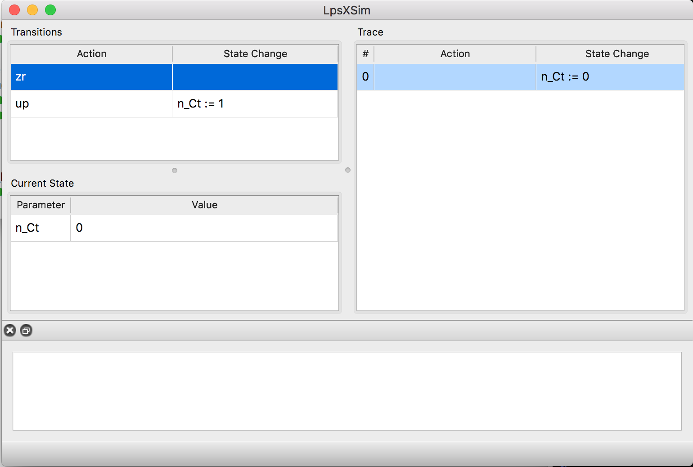
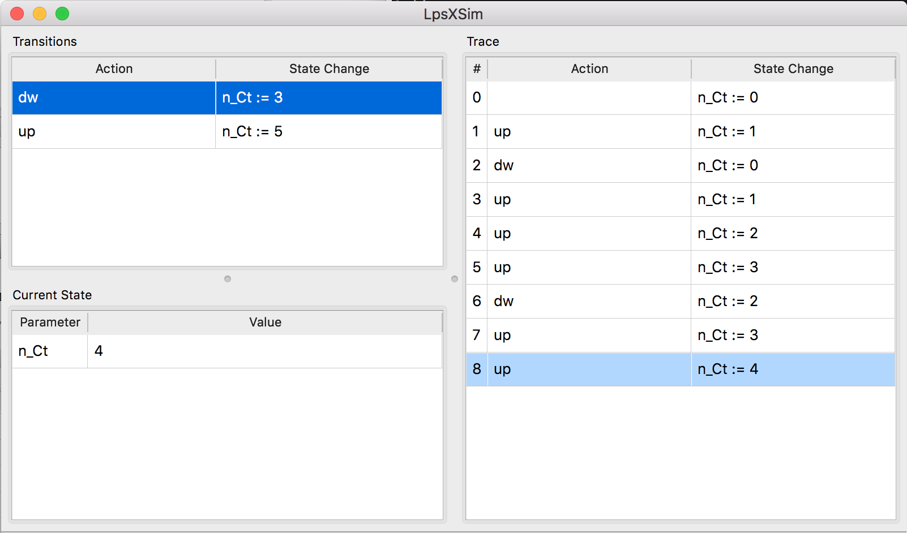
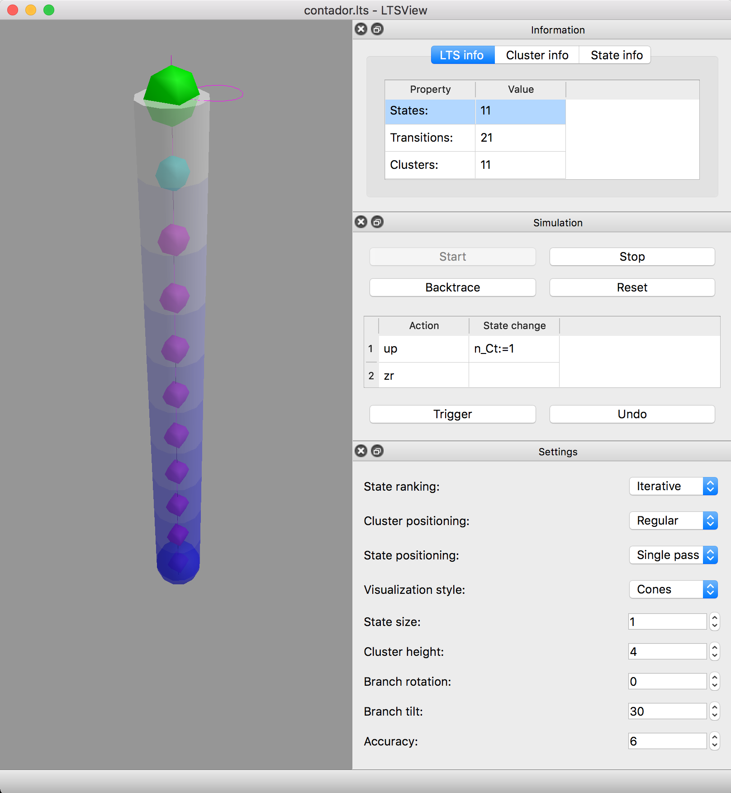
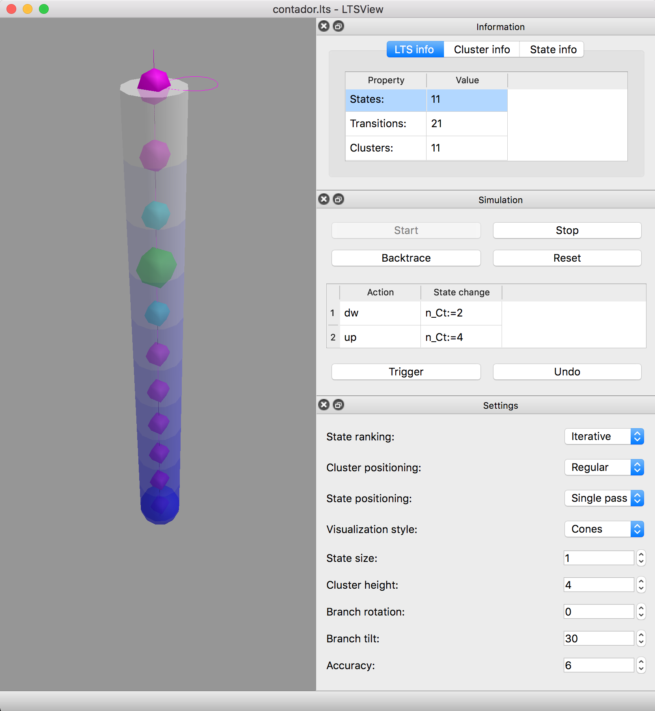
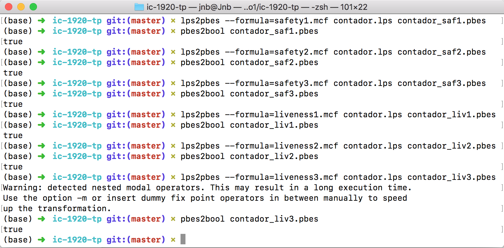

# TP 1: Interacção e Concorrência

## Questão 1

Apresentamos de seguida o código em mCRL2 que define o modelo de um contador com o processo $Ct$ referido no enunciado.
De forma a ser viável a apresentação com as ferramentas utilizadas colocamos $N = 10$ como valor limite de $n$.

```mcrl2
act up, zr, dw;

proc Ct(n: Int) = (n > 0)
               -> (dw . Ct(pred(n)) + up . Ct(succ(n)))
               <> (up . Ct(1) + zr . Ct(0))
    ;

init Ct(0);
```

Utilizámos as ferramentas `lpsxsim`, `ltsgraph` e `ltsview` para observar o comportamento deste processo.

### ltsgraph

Usamos esta ferramenta de forma a verificar o  grafo de transição do processo.


### lpsxsim

Usamos esta ferramenta para verificar de forma local, em cada estado, que ações são possíveis de realizar.







### ltsview

Esta ferramenta permite-nos verificar as ações possíveis de realizar em cada estado, como com lpsxsim, acrescentando uma parte gráfica em 3D ajudando na percepção da mesma.






\pagebreak

## Questão 2

Os processos $C^n$ e $Ct_n$ ($n \in \mathbb{N}$) sao deterministas pois $\forall\ p \in S, a \in N : \exists! q \in S : (p, a, q) \in \rightarrow$ [^lts_determinism], e como tal, $Tr(C^n) = Tr(Ct_n) \Leftrightarrow C^n \sim Ct_n \Rightarrow C^n = Ct_n$. Portanto a nossa prova é a de igualdade dos traços de $C^n$ e de $Ct_n$.

Caso $n = 0$:
 :  $$Tr(C^n) = Tr(Ct_n)$$
    $$\Leftrightarrow \{\ def\ Tr\ \}$$
    $$\{\epsilon\} \cup zr \cdot Tr(C^n) \cup up \cdot Tr(C^{n+1}) = \{\epsilon\} \cup zr \cdot Tr(Ct_n) \cup up \cdot Tr(Ct_{n+1})$$

Caso $n > 0$:
 :  $$Tr(C^n) = Tr(Ct_n)$$
    $$\Leftrightarrow \{\ def\ Tr\ \}$$
    $$\{\epsilon\} \cup dw \cdot Tr(C^{n-1}) \cup up \cdot Tr(C^{n+1}) = \{\epsilon\} \cup dw \cdot Tr(Ct_{n-1}) \cup up \cdot Tr(Ct_{n+1})$$

Tanto no caso $n = 0$, como no caso $n > 0$, existe uma dependência do caso seguinte, $n + 1$; no entanto, este caso $n + 1$ pode ser provado de forma similar, e portanto a prova é válida.

## Questão 3

A ferramenta mCRL2 não permite implementar a versão genérica, descrita no enunciado, dos processos $C$, $P$, e $Z$, portanto não será possível verificar a igualdade dos dois modelos com a ferramenta. No entanto, é possível implementar uma versão mais restrita e finita de $C$ e $Ct$, e verificar a igualdade entre estes dois modelos.

`ltscompare -e bisim-gv Ctm.lts Cm.lts`{.sh}

**TODO:** ver o `Cm.mcrl2`

## Questão 4

Iremos apresentar propriedades de segurança e animação sobre o processo $Ct_m$.

### Alínea _a_

#### Propriedades de Segurança

 1. `[true*.up.zr]false` -- Impossível fazer transição por $up$ seguida de $zr$.
 2. `[true*]<true>true` -- Qualquer sequência de ações chega sempre a um estado que tem a possibilidade de fazer mais uma ação, i.e., ausência de deadlock.
 3. `[true*.zr.dw]false` -- Impossível haver uma transição por $zr$ seguida de $dw$.

#### Propriedades de Animação

 1. `[up]<dw>true` -- Depois de aumentar o contador com a ação $up$, podemos sempre decrementar com a ação $dw$.
 2. `[zr+]<zr+up>true` -- Após um ou mais $zr$ pode ser feito um $zr$ ou um $up$.
 3. `[up.up]<dw><dw>true` -- Após duas transições seguidas por $up$ é sempre possível duas transições seguidas por $dw$.

### Alínea _b_



## Questão 5

### Alínea _a_

**TODO:** adaptar o `Cm.mcrl2`

### Alínea _b_

## Referências

 * [_Labelled transition systems: Determinism_][lts_determinism]

[^lts_determinism]: Ver [_Labelled transition systems: Determinism_][lts_determinism]

[lts_determinism]: https://www.mcrl2.org/web/user_manual/articles/lts.html#determinism
